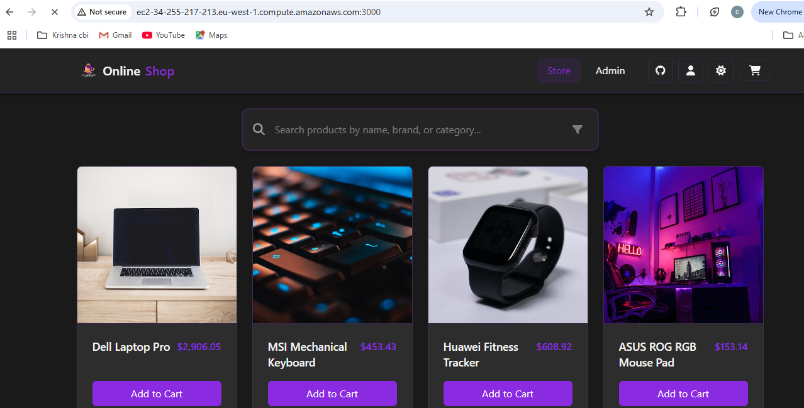
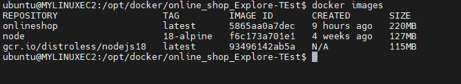
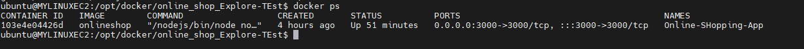

# Project Branches Overview

## Branches

### Development
This is the primary branch where active development takes place. All new features and bug fixes are merged into this branch before they are released.

### Hackathon
This branch is dedicated to hackathon projects. It includes experimental features, rapid prototyping, and proof-of-concept implementations.

## Feature Branches

### `feature/Docker_Compose`
This branch introduces a `docker-compose.yml` file, which simplifies the process of managing multiple containers.

#### What is Docker Compose?
Docker Compose is a tool for defining and running multi-container Docker applications. Using a `docker-compose.yml` file, you can configure services, networks, and volumes in a declarative way.

#### Key Features of Our Docker Compose Implementation
- Defines services such as app, database, and cache.
- Configures environment variables for seamless container communication.
- Allows easy scaling and management of services.
- Supports volume persistence to retain data across restarts.

Check out the `docker-compose.yml` file in this branch for detailed configuration.

---

### `feature/Multi_stage_dockerfile`
This branch implements a multi-stage Dockerfile to optimize image size and enhance security.

#### What is a Multi-Stage Dockerfile?
A multi-stage Dockerfile allows the use of multiple `FROM` statements to build images in stages. This helps reduce the final image size by eliminating unnecessary dependencies.

#### Benefits of Multi-Stage Builds:
- Smaller and more secure images.
- Reduced build time and dependencies in the final container.
- Cleaner and more efficient Docker images.

Check out the Dockerfile in this branch for the complete setup.

---

### `feature/Single_stage_Dockerfile`
This branch contains a single-stage Dockerfile implementation.

#### What is a Single-Stage Dockerfile?
A single-stage Dockerfile builds an image in one step, which may lead to larger image sizes but is simpler for smaller applications.

#### Key Features:
- Direct build without intermediate stages.
- Simplicity and ease of debugging.

Check out the Dockerfile in this branch for detailed configuration.

---

### `feature/vite_Port_config`
This branch focuses on configuring ports and host settings in Vite.js.

#### Vite Port and Host Configuration
- The `server` configuration in `vite.config.js` is updated to allow custom ports and host settings.
- This enables access to the Vite server from different machines in a network.

#### Execution and Hosting
- All tasks related to this feature have been successfully completed and executed.
- Below are snapshots showcasing the hosted application, Docker image, and running container.

  )
  
  

-